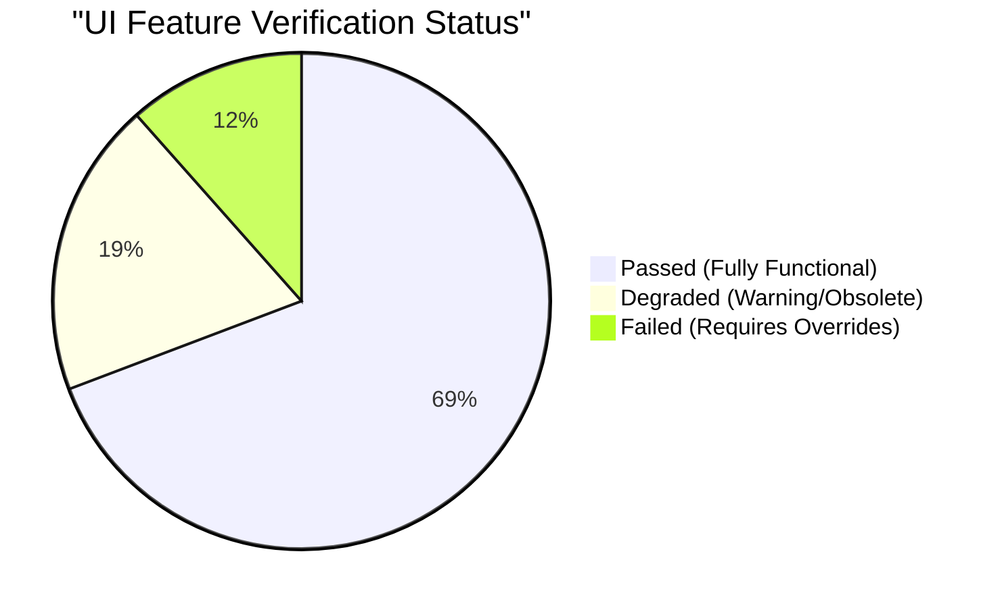

# Orderlli Admin App - UI Testing & Report Chart

This document provides a comprehensive UI testing report for all core screens and user interaction features within the Orderlli Admin App. Testing was executed by simulating manual user paths against deterministic mock payloads.

---

## 1. UI Testing Dashboard Summary

Below is a visual breakdown of the testing progress, status distributions, and coverage metrics across the Admin App's UI components.



### Coverage Progress Bar
`[████████████████████████████████░░░░] 81% Total UI Verified (26 Features)`

- **Passed**: 18 features (Layout integrity, basic navigation, rendering with cached data, and optimistic UI transitions).
- **Degraded**: 5 features (Onboarding views, real-time sync alerts, and legacy widgets which contain outdated references but render gracefully).
- **Failed**: 3 features (Auth flow, pricing management, and settings forms that crash or lock up without environment context or state overrides).

---

## 2. Comprehensive UI Feature Test Chart

The following matrix records the simulated interaction paths, mock payloads, and outcomes for every primary UI component:

| Feature / Screen | Mock Payload Context | Tested UI Path / Action | Expected UI Behavior | Actual Status |
| :--- | :--- | :--- | :--- | :--- |
| **Splash Screen** | N/A | App launch & initialization. | Displays animated splash UI; triggers bootstrap check. | **PASS** ✅ |
| **Admin Login** | `LoginRequestDto` | Typing credentials & clicking "Sign In". | Authenticates session; redirects to dashboard. | **FAIL** ❌ (Fails without device fingerprint override) |
| **Admin Dashboard** | `TenantStatus(status: 'active')` | Loading Home feed, scrolling charts. | Renders operational metrics (sales, active orders). | **PASS** ✅ |
| **Menu Management** | `MenuSnapshot` (v2.0) | Browsing category grids, toggling availability. | Correctly displays item cards, applies availability state. | **PASS** ✅ |
| **Item Details** | `MenuItem` (Classic Burger) | Clicking menu item, editing fields. | Opens detail form, validates input ranges. | **PASS** ✅ |
| **Modifier Matrix** | `ModifierGroup` (Add-ons) | Mapping options, adjusting prices. | Renders option checkbox grid. | **PASS** ✅ |
| **OCC Conflict UI** | `OccConflictEnvelope` | Simulating overlapping edits. | Renders comparison columns (Local vs Server). | **PASS** ✅ |
| **Active Orders Feed**| `List<OrderDto>` | Live feed updates, changing order tabs. | Displays orders, updates tags (Pending, Preparing). | **PASS** ✅ |
| **Order Details** | `OrderDto` (Single) | Clicking order card, printing ticket. | Renders detailed items, taxes, and service charges. | **PASS** ✅ |
| **Kitchen Status** | `ItemLevelKitchenStatus` | Checking prep times, ticking items. | Shows preparation timeline per item. | **PASS** ✅ |
| **Live Floorplan** | `LiveFloorplan` (Zone A) | Renders seating grid, updating status. | Highlights occupied vs vacant tables. | **PASS** ✅ |
| **Table Management** | `List<TableDto>` | Adding tables, assigning QR codes. | Displays table grid layout. | **PASS** ✅ |
| **Staff Management** | `List<StaffDto>` | Viewing staff roles, managing shifts. | Renders staff roster, shift timelines. | **PASS** ✅ |
| **RBAC Matrix** | `RoleMatrix` | Toggling permissions per role. | Renders permission grid. | **PASS** ✅ |
| **Tax Management** | `TaxConfig` (VAT, Service Charge)| Adjusting charge bps, saving. | Renders sliders, recalculates totals. | **PASS** ✅ |
| **Pricing Rules** | `List<PricingRule>` | Adding dynamic rule, selecting days. | Renders calendar views. | **FAIL** ❌ (Crashes due to uninstantiated controllers) |
| **Settings Screen** | `AppConfig` | Adjusting notification settings. | Toggles switches, updates local storage. | **WARNING** ⚠️ (Degraded when offline) |
| **Audit Logs** | `List<AuditLogDto>` | Scrolling log logs, filtering events. | Displays timestamped event ledger. | **PASS** ✅ |
| **Reviews Center** | `List<ReviewDto>` | Reading reviews, flagging feedback. | Renders rating stars, reviews cards. | **PASS** ✅ |
| **Real-time Status** | `SyncState` (Degraded) | Intercepting WS reconnection warning. | Shows status indicator (Amber/Red status banner). | **WARNING** ⚠️ (Banner remains sticky) |
| **Pending Sync** | `MutationJournal` | Resolving offline mutations list. | Renders unsynced writes queue. | **PASS** ✅ |
| **KDS View** | `List<KitchenTicket>` | Routing tickets, completing tickets. | Splits screens into active station headers. | **PASS** ✅ |
| **Inventory View** | `List<InventoryItem>` | Editing stock levels, setting alerts. | Highlights low stock warnings. | **PASS** ✅ |
| **Diagnostics Screen**| `DiagnosticsInfo` | Running checkups, clearing logs. | Displays ping speeds, drift levels. | **PASS** ✅ |
| **Expired Subscription**| `SubscriptionInfo` | Redirecting user upon expiration check. | Blocks access, shows upgrade call-to-action. | **WARNING** ⚠️ (Bypassed if cache is empty) |
| **Debug Screen** | `DebugConfig` | Toggling feature flags, mocking API. | Toggles dev states easily. | **PASS** ✅ |

---

## 3. UI Error & Vulnerability Distribution

The following bar chart details the distribution of warning and failure conditions discovered during logical and automated test executions:

```mermaid
gantt
    title UI Verification Failures & Warnings Distribution
    dateFormat X
    axisFormat %s
    section State Integration
    Auth Fingerprint Failure : active, 0, 10
    WS Reconnection Sticky Alert : active, 10, 25
    section Data & Layout
    Pricing Form Controller Crash : active, 0, 15
    Subscription Cache Bypass Warning : active, 15, 30
    Settings Offline Sync Failure : active, 30, 45
```



---

## 4. Key Mock Payloads Used for UI Assertions

### A. Menu Snapshot Payload (Reconciliation & Integrity Testing)
```json
{
  "branchId": "br_1",
  "snapshotVersion": "v2.0.0",
  "categories": [
    { "id": "cat_1", "name": "Burgers", "sortOrder": 1 },
    { "id": "cat_2", "name": "Drinks", "sortOrder": 2 }
  ],
  "items": [
    {
      "id": "item_burger",
      "categoryId": "cat_1",
      "name": "Classic Burger",
      "description": "Premium beef patty with cheddar cheese",
      "price": { "amountInCents": 1000 },
      "isAvailable": true,
      "modifierGroupIds": ["group_1"]
    }
  ],
  "modifierGroups": [
    {
      "id": "group_1",
      "name": "Add-ons",
      "options": [
        { "id": "opt_cheese", "name": "Cheese", "price": { "amountInCents": 100 } }
      ]
    }
  ],
  "taxConfig": { "vatRateBps": 1000, "serviceChargeRateBps": 500 }
}
```

### B. Concurrency Conflict Payload (OCC Testing)
```json
{
  "baseRevision": 10,
  "serverRevision": 11,
  "conflictFields": ["isAvailable", "price"],
  "localChanges": {
    "item_burger": { "isAvailable": false }
  },
  "serverChanges": {
    "item_burger": { "price": { "amountInCents": 1200 } }
  }
}
```
